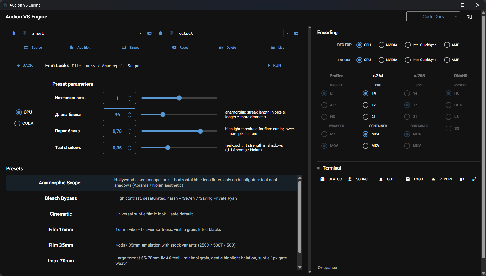

# Audion VS Engine

<!-- audion:release -->
<p align="center">
  <a href="https://audion.dev/downloads/vs-engine"></a>
  <a href="https://github.com/Tensionix/vs-engine/releases/latest"></a>
  <a href="https://github.com/Tensionix/vs-engine/releases"></a>
  <a href="https://github.com/Tensionix/vs-engine/blob/main/LICENSE"></a>
</p>

**Version 2.0.2** · 2026-09-01 · 7.7 MB

- [Direct download](https://dl.audion.dev/vs-engine/2.0.2/Audion_VS_Engine_v2.0.2.zip) — unmetered, no rate limits
- [Project page](https://audion.dev/downloads/vs-engine) — every version and how to install

<p align="center"></p>

`SHA-256: 43256bcb4879bcdca05b6adaa45a0bc01f0d7ee1f823de8a9ea6dbf0153da5f8`

---

An **Audion** tool, published by [Tensionix](https://github.com/Tensionix).
<!-- /audion:release -->

Portable Windows toolkit for **technical video preprocessing and stylization** built on VapourSynth + FFmpeg. **28 presets across 4 independent palettes**:

| Palette | Presets | What it does |
|---|---|---|
| **Precision Engine** | 8 | Denoise (incl. SOTA shadow-targeted BM3D), debanding, controlled fine-grain restoration. Technical layer that goes BEFORE the colorist. |
| **Film Looks Engine** | 7 | Cinematic emulations: 35mm Kodak (250D/500T/50D), 16mm, Super 8, Bleach Bypass, IMAX 70mm, universal "Cinematic". |
| **Retro Engine** | 3 | Analog character: VHS / CRT, Camcorder 90s, Polaroid SX-70. |
| **Restoration Engine** | 10 | "Things you cannot do in Adobe / DaVinci out of the box": QTGMC, TIVTC, MVTools-MCDeGrain, derainbow, deblock, dehaze + ML (Real-ESRGAN 2x, Soft HD Rebuild 2X, RIFE 60fps, DPIR via vs-mlrt). |

The engine is a **CLI-driven Python orchestrator** wrapping `vspipe | ffmpeg` pipelines. Launchers are batch files with FZF + CMD fallback (English and Russian copies).

---

## First run: install the engine

The build ships without VapourSynth, its plugins and the vs-mlrt models. They
are not ours to redistribute — some seventy modules, each under its own licence,
close to three gigabytes together. The program installs them itself, from their
authors, in a couple of clicks.

Until you do that, **the program will not process anything.** It starts, but the
engine behind it is missing.

Run `builder_main.cmd` (or Start → the build menu) and pick, in this order:

| # | Menu entry | What it installs |
|---|---|---|
| 10 | `VAPOURSYNTH` | the engine itself — required |
| 11 | `VS PLUGINS` | the filters the presets call — required |
| 14 | `VS-MLRT LEAN` | neural models trimmed to your own GPU |
| 15 | `VS-MLRT FULL` | the complete model bundle |

The order matters: plugins need the engine already in place.

Steps 14 and 15 are for NVIDIA RTX cards and are optional — without them
everything except the neural filters works. Prefer `VS-MLRT LEAN`: it keeps only
what your card can actually run, instead of the full bundle for every vendor.

## FFmpeg and your NVIDIA driver

Newer is not always better. Every FFmpeg build is compiled against one specific
version of the NVENC headers, and each of those demands a minimum driver. Put
the newest build on an older driver and hardware encoding does not get faster —
it stops working.

| FFmpeg build | NVENC headers | Minimum NVIDIA driver (Windows) |
|---|---|---|
| 9.0.1 | ffnvcodec n13.1.15.0 | **610.0** |
| 8.0.1 | ffnvcodec n13.0.19.0 | **570.0** |
| 7.1.1 | ffnvcodec n13.0.19.0 | **570.0** |
| 7.1 | ffnvcodec n12.2.72.0 | 551.76 |

Note the third row: 7.1.1 is built with the same headers as 8.0.1, so it needs
the same 570.0 — going "one version back" buys nothing on an older driver. The
step that does help is 7.1 without the patch release.

This is why the installer picks a build from your driver version instead of
always taking the latest. The versions above are read from the build's own
README; the driver thresholds come from the nv-codec-headers README.

If you have no NVIDIA GPU, none of this applies — the latest build is installed
and encoding runs on the CPU.

**Which build ships with this product: 8.0.1.** That is a deliberate choice, not
a missed update. Most editing and encoding machines today run drivers roughly
between 571 and 609; the 610 branch is installed by very few. Both 8.1.x and
9.x demand that branch — shipping them would advertise NVIDIA hardware encoding
and then deny it to most of the people it was promised to. 8.0.1 has everything
these products use and runs on the drivers people actually have.


## Quick start

1. Unpack the project anywhere on your drive (it's portable, no install needed).
2. Run **`launcher_project.cmd`** — top-level dispatcher: `[P]` Precision / `[F]` Film Looks / `[R]` Retro / `[N]` Restoration / `[A]` Apply profile to file or folder.
3. Drop your source media into `input\`, results go to `output\`.

That's it. Each palette launcher walks you through input → params → encoder → run.

---

## First-time install (do this once before Quick start)

If the project tree was just unpacked / cloned and `system_core/vapoursynth/` / `Tools/ffmpeg/` are still empty — run **`builder_main.cmd`** and walk through items in this exact order:

```
Stage 1 - Orchestrator Python (auto-runs on first launch of any *.cmd, but
          you can pre-flight it):
  [01] BUILD PORTABLE ENV CMD BUILDER     (or [03] INSTALL PORTABLE OFFLINE)

Stage 2 - Core VS engine stack (this is where the non-ML core becomes usable):
  [04] POWERSHELL                       - pwsh 7 portable
                                            * SKIP if `pwsh -v` already shows 7+ on system
  [10] VAPOURSYNTH                      - latest VS stable + own embedded Python 3.12.x
  [11] VS PLUGINS                       - vsrepo + plugins (depends on [10])
  [12] FFMPEG                           - portable ffmpeg

Optional MLRT step (run only if you need ML presets):
  [14] VS-MLRT LEAN                     - downloads MLRT for this machine
                                            (kept out of the core archive)
  [15] VS-MLRT FULL                     - advanced offline / multi-GPU bundle

Stage 3 - Verify (only meaningful AFTER stage 2):
  [71] VERIFY / DOCTOR                  - runs doctor.py end-to-end smoke
                                            (live BM3D CUDA invocation if NVIDIA)

Stage 4 - Optional cache cleanup:
  [70] CLEAN INSTALL CACHE              - frees transient install cache/staging
                                            archives. Re-installing later
                                            re-downloads automatically.
```

> **Why running [04] earlier reports failures**: doctor.py probes the full stack (vspipe, plugins, ffmpeg, optional CUDA). Before stage 2 those binaries don't exist yet — the failures are expected, not bugs.

> **About portable PowerShell ([10])**: Windows 10/11 ships only Windows PowerShell 5.1, but our `install/*.ps1` scripts use PS 7+ syntax (ternary, null-coalescing). So **[10] is required unless `pwsh -v` already shows 7+** on the host. The `.cmd` wrappers auto-detect and prefer system pwsh 7+ over the portable copy when both exist.

---

## Four palettes — concrete content

### Precision Engine (`cli\launcher_precision.cmd`)

Pipeline-ordered menu reads top-to-bottom as the actual signal flow:

```
=== Stage 1 -- Denoise (clean first) ===
[01] Mild denoise              DFTTest spectral, light/medium/strong
[02] Shadow denoise SOTA  *    BM3D (CUDA->CPU) + smooth luma-mask "shadows only"
[03] Chroma cleanup            DFTTest on chroma planes only

=== Stage 2 -- Deband (smooth gradients) ===
[04] Deband safe               neo_f3kdb light, no grain
[05] Deband + fine grain       neo_f3kdb + AddGrain micro-restore

=== Stage 3 -- Compositions (full chains) ===
[06] Filmic rebuild       *    denoise -> deband -> luma-zoned grain (flagship)
[07] Archive clean             neutral master, no grain
[08] Pre-grade prep            minimum-touch handoff to DaVinci Resolve
```

### Film Looks Engine (`cli\launcher_film_looks.cmd`)

7 looks ordered by character intensity (subtle → extreme):

```
[01] Cinematic                 universal subtle filmic, safe default
[02] Film 35mm                 Kodak 250D / 500T / 50D variants
[03] Film 16mm                 organic, grainier, lifted blacks
[04] Super 8                   heaviest grain, faded 70s
[05] Bleach bypass             high contrast, desaturated ('Se7en')
[06] IMAX 70mm                 large-format -- minimal grain, gentle halation, 1px gate weave
[07] Anamorphic scope          horizontal blue lens flares + teal-cool shadows (cinemascope)
```

All Film Looks share a common helper library (`system_core/vapoursynth/vs-scripts/audion_lib.py`): MTF softening, halation bloom, luma-zoned grain, gamma curve, black-lift, desaturation.

### Retro Engine (`cli\launcher_retro.cmd`)

```
[01] VHS / CRT                 chroma bleed, soft optics, analog noise
[02] Camcorder 90s             softer than VHS, slight overexposure
[03] Polaroid                  1970s SX-70: candy-bloom highlights, warm cream, edge vignette
```

### Restoration Engine (`cli\launcher_restoration.cmd`)

The "Adobe / DaVinci cannot do this out of the box" set. Requires extra plugins (havsfunc, mvsfunc, mvtools, tivtc) — installed automatically via `Install-VS-Plugins.cmd`.

```
=== Field rebuild ===
[01] QTGMC deinterlace         NNEDI3 + MVTools; gold-standard deinterlace for legacy DV/HDV/VHS
[02] TIVTC inverse-telecine    NTSC 29.97 telecined -> 23.976 progressive (3:2 pulldown removal)

=== Motion-compensated denoise ===
[03] MVTools MCDeGrain         temporal denoise that keeps detail (Topaz-style internals)
[04] Derainbow / decross       NTSC composite chroma cleanup (rainbow, dot crawl)

=== Compression rescue ===
[05] Deblock H.264 artefacts   over-compressed YouTube / WhatsApp / SD broadcast salvage
[06] Dehaze / local contrast   clarity, no halos, no color shift, 16-bit math

=== AI / ML  (vs-mlrt; TensorRT on NVIDIA, DirectML elsewhere) ===
[07] Real-ESRGAN 2x upscale    ML upscale 1080p -> ~4K, sharp face/fabric texture
[08] Soft HD Rebuild 2X        cleanup + ML reconstruction for soft / undersampled HD
[09] RIFE 60fps interpolation  ML frame interp 24->60fps, smoother than Optical Flow
[10] DPIR ML denoise           heavy noise / high-ISO without losing texture
```

The core release does not need to carry the MLRT payload. ML presets require a separate install/update step via `builder_main.cmd → [14] VS-MLRT LEAN`, which downloads the backend/model set for the current machine and cleans only its own `plugins\vsmlrt` subtree. `[15]` remains an advanced full/offline bundle path for multi-GPU distribution, not the default public package. **Full update rule:** after updating VapourSynth or the base VS plugins, run the MLRT installer again before smoke-testing ML presets. Backend is auto-selected per machine: TensorRT (NVIDIA, optional) → DirectML (any DX12 GPU) → CPU. OpenVINO/vsov is quarantined after extraction under `system_core\vapoursynth\disabled_plugins\vsmlrt-openvino` to avoid Windows `Bad Image` `0xc0e90002` during VapourSynth autoload. Cross-vendor stable via `audion_lib.vsmlrt_backend_chain()` — non-NVIDIA boxes don't burn 30–120 s on a doomed TRT engine compile.

> **Full per-preset reference, decision tree, install/maintenance script map, encoder ladder, pipeline scenarios — see [`GitHub/VapourWiki_EN.md`](GitHub/VapourWiki_EN.md) (and Russian: [`GitHub/VapourWiki_RU.md`](GitHub/VapourWiki_RU.md)).** That document is the canonical detailed reference; this README is the user-facing landing page.

---

## System requirements

- Windows 10/11 x64
- ~1.5 GB free disk space for the core package after unpack; optional MLRT components require additional space after `[14]`
- Optional: NVIDIA GPU + driver R525+ for `bm3dcuda` acceleration (10–50× speedup vs CPU). Without it, BM3D runs on CPU as a documented fallback path.
- No system Python required — embedded Python ships in `runtime/`.
- No system FFmpeg required — portable FFmpeg ships in `Tools/ffmpeg/`.

If something is missing, run `launcher_project.cmd` → `[D] Doctor` for a stack diagnosis.

---

## Architecture (brief)

The project uses **two independent embedded Pythons**:

```
runtime/python.exe                          # Orchestrator (latest Python 3.12.x)
system_core/vapoursynth/python.exe          # VS-host (latest Python 3.12.x) -- runs vspipe + plugins
```

The orchestrator never imports VapourSynth. It calls `system_core/vapoursynth/Scripts/vspipe.exe` as a subprocess and pipes the y4m stream into `Tools/ffmpeg/bin/ffmpeg.exe`.

Important for VS R74+: the real plugin autoload directory comes from `vapoursynth.get_plugin_dir()` and, in the wheel layout, lives under `Lib\site-packages\vapoursynth\plugins\`. The old `system_core\vapoursynth\vs-plugins\` folder is legacy; it may be empty and must not be used for install/status output.

```
launcher_*.cmd → runtime/python.exe system_core/main.py run \
                   --palette X --preset Y --input ... --output ...
                 ↓
                 ↓ subprocess: vspipe -c y4m preset.vpy - | ffmpeg -i - ... output
                 ↓
                 ↓ all .vpy presets read params from AUDION_VS_* env vars
                 ↓
                 ↓ JSON report dropped in logs/{ts}__{palette}__{preset}__{stem}.json
```

Plugin set (auto-installed via `Install-VS-Plugins.cmd`):

- v1.0 set: `lsmas`, `ffms2`, `fmtconv`, `neo_f3kdb`, `addgrain` (`grain` namespace), `knlmeanscl` (`knlm`), `bm3dcpu`, `dfttest`
- `bm3dcuda` (NVIDIA acceleration; **bundled by default since Phase 18.A0**, opt-out via `/NO-CUDA`)
- Restoration set (Phase 18.B): `havsfunc`, `mvsfunc`, `mvtools`, `tivtc`, `znedi3`

---

## CLI reference (advanced)

```cmd
runtime\python.exe system_core\main.py <command> [args]
```

Subcommand summary:

| Command | What it does |
|---|---|
| `info` | Print resolved paths, Python versions, plugin namespace count |
| `doctor` | Run `system_core/doctor.py` — full stack health (Pythons, vspipe, plugins, ffmpeg, optional CUDA live smoke) |
| `list-presets` | All 28 registered presets across 4 palettes, with default params and palette grouping |
| `list-encoders` | All 34 encoder profiles (software CRF / NVENC / QuickSync / AMF / ProRes / DNxHR) with a one-line description each |
| `list-profiles` | Built-in (5) + user-defined profiles from `config\profiles\*.json` |
| `materialize-profiles [--force]` | Write the 5 built-in profiles to `config\profiles\` as editable JSON (idempotent; `--force` overwrites) |
| `probe --input X` | ffprobe summary (codec, resolution, fps, duration, audio streams, color metadata) |
| `run --palette P --preset Q --input I --output O [params...]` | Full processing pipeline: `vspipe → ffmpeg` |
| `apply-profile --name N --input I --output O [--no-audio]` | Run a saved profile against a single file |
| `apply-profile-batch --name N --input-dir D --output-dir E [--recursive] [--no-mirror] [--overwrite] [--no-audio]` | Run a profile across a folder; with `--recursive` walks subfolders, mirrors source tree (opt-out: `--no-mirror`), skips already-processed files (opt-out: `--overwrite`) |

Common `run` flags (forwarded into `AUDION_VS_*` env vars per `MEMORY.md §7`): `--strength {light,medium,strong}`, `--sigma <float>`, `--use-cuda 0|1`, `--grain-back <float>`, `--shadow-threshold <0..1>`, `--transition <0..1>`, `--deband-range <int>`, `--grain-shadow / --grain-mid / --grain-high <float>`, `--high-threshold <0..1>`, `--stock {250D,500T,50D}` (film_35mm), `--intensity <float>`, `--field-order {tff,bff}`, `--qtgmc-preset {Faster,Fast,Medium,Slow,Slower,Placebo}`, `--output-fps {single,double}`, `--radius <int>`, `--thsad <int>`, `--blksize <int>`, `--quant1 / --quant2 <int>`, `--fps-mul <float>`, `--model <name>`, `--tile <int>`, `--backend {auto,trt,ort_dml,ort_cpu}`, `--encoder <profile>`, `--no-audio`. Run `... main.py run --help` for the full list.

Common run examples:

```cmd
:: Shadow denoise SOTA, BM3D on CPU (Intel/AMF), with grain restore
runtime\python.exe system_core\main.py run ^
   --palette precision --preset shadow_denoise_sota ^
   --input input\dark_clip.mov --output output\clean.mp4 ^
   --sigma 2.5 --grain-back 0.6 --shadow-threshold 0.20 ^
   --encoder h264_crf14 --no-audio

:: Filmic rebuild — full Stage 3 composition
runtime\python.exe system_core\main.py run ^
   --palette precision --preset filmic_rebuild ^
   --input input\source.mp4 --output output\filmic.mp4 ^
   --sigma 2.0 --deband-range 14 --encoder h265_crf21 --no-audio

:: Kodak 35mm 500T (tungsten-balanced), full intensity
runtime\python.exe system_core\main.py run ^
   --palette film_looks --preset film_35mm ^
   --input input\source.mov --output output\film35_500t.mp4 ^
   --stock 500T --intensity 1.0 --encoder prores_422hq

:: VHS/CRT retro
runtime\python.exe system_core\main.py run ^
   --palette retro --preset vhs_crt ^
   --input input\source.mp4 --output output\vhs.mp4 ^
   --intensity 1.2 --encoder h264_crf14

:: Restoration -- QTGMC deinterlace of a legacy DV / HDV / VHS clip
runtime\python.exe system_core\main.py run ^
   --palette restoration --preset qtgmc_deinterlace ^
   --input input\interlaced.mov --output output\progressive.mp4 ^
   --field-order tff --qtgmc-preset Medium --output-fps single ^
   --encoder prores_lt --no-audio

:: Restoration -- MVTools-MCDeGrain temporal denoise (keeps detail)
runtime\python.exe system_core\main.py run ^
   --palette restoration --preset mvtools_mcdegrain ^
   --input input\noisy_iso6400.mp4 --output output\clean_detail.mp4 ^
   --radius 2 --thsad 200 --blksize 16 --encoder h264_crf14 --no-audio
```

Encoder profiles (21 total, ladder 14/17/21): software `h264_crf{14,17,21}` / `h265_crf{14,17,21}` (default `h264_crf14`); NVENC hardware `h264_nvenc_q{14,17,21}` / `h265_nvenc_q{14,17,21}`; ProRes `prores_lt` (Audion default) / `prores_lt_mxf` / `prores_422` / `prores_422hq` / `prores_422hq_mxf`; DNxHR `dnxhr_lb/sq/hq/hqx`.

---

## Profiles (saved combinations)

Profiles let you save palette + preset + params + encoder under a memorable name and apply with one command. **Built-in profiles ship with v1.0**:

| Name | What |
|---|---|
| `shadow_clean_quick` | Fast shadow-noise cleanup of dark digital footage |
| `filmic_warm_35mm` | Kodak 250D 35mm filmic look at intensity 1.0 |
| `archival_master` | Neutral archival master, ProRes LT (or HQ for keying) |
| `resolve_handoff` | Minimum-touch prep, ProRes LT (MXF wrapper available) for DaVinci / Avid |
| `vhs_dreamy` | VHS/CRT retro at intensity 1.2 |

Usage:

```cmd
runtime\python.exe system_core\main.py list-profiles
runtime\python.exe system_core\main.py apply-profile --name filmic_warm_35mm ^
   --input input\source.mov --output output\filmic.mp4
```

All 5 built-ins **auto-materialize** as editable JSON files in `config\profiles\` on first use of `list-profiles` / `apply-profile`. To force-rewrite them: `runtime\python.exe system_core\main.py materialize-profiles --force`.

**Batch over a folder** (the killer UX for "footage piling up on disks"):

```cmd
runtime\python.exe system_core\main.py apply-profile-batch ^
   --name filmic_warm_35mm --input-dir input\shoot_2026_04 ^
   --output-dir output\shoot_2026_04_filmic --no-audio
```

Outputs are named `<stem>__<profile>.mp4`. Pass `--recursive` to walk subfolders.

**Custom profiles**: copy any `config\profiles\*.json` to a new name, edit `params` / `encoder` / `description`, and it shows up automatically in `list-profiles`. Format:

```json
{
  "palette": "precision",
  "preset": "shadow_denoise_sota",
  "params": { "sigma": 2.5, "grain_back": 0.6, "shadow_threshold": 0.20 },
  "encoder": "h264_crf14",
  "description": "My night-footage cleanup"
}
```

---

## Portability

The project is **fully portable**. Copy-paste the whole folder to any Windows drive or machine and it runs. No installer, no system Python, no PATH/registry changes — every component (both embedded Pythons, VapourSynth host, ffmpeg, fzf, portable PowerShell 7) lives inside `system_core/`. After moving the folder, run **`install\Repair-PipShims.cmd` once** to fix the pip-launcher shebangs (see *Diagnostic & maintenance scripts* below). The only out-of-tree dependency is the NVIDIA video driver if you want CUDA.

---

## CUDA setup (NVIDIA machines only)

`bm3dcuda` is the optional accelerated BM3D plugin. To enable it you need either:

- **NVIDIA Studio Driver R525+** (Game Ready works too; Studio is preferred for stability) — the driver itself ships `cudart64_12.dll` and `cufft64_*.dll` in `C:\Windows\System32\`, which is everything `bm3dcuda` needs at runtime. **OR**
- **NVIDIA driver + CUDA Toolkit 12.x or 13.x Network installer, "Runtime libraries" component only (~300 MB)** — needed in the few cases where the driver-bundled runtime does not match the plugin build (e.g. on the latest Blackwell sm_120 cards we used Toolkit 13.2.3 to JIT-compile PTX cleanly).

The full CUDA SDK (~3 GB), cuDNN, and TensorRT are **not** required.

### Which NVIDIA GPU works

`bm3dcuda` is built against CUDA 12.x; the formal floor is Compute Capability ≥ 5.0 (Maxwell, 2014). In practice:

| Generation | Compute | Cards | Notes |
|---|---|---|---|
| Maxwell | 5.0–5.2 | GTX 750/750 Ti, GTX 9xx | Works, but small VRAM and minimal speedup vs CPU |
| Pascal | 6.0–6.1 | GTX 10-series | **Practical minimum.** 4–8 GB VRAM, clear gain on 1080p/4K |
| Turing | 7.5 | GTX 1650/1660, RTX 20-series | Solid. Field-tested on GTX 1650 Super |
| Ampere | 8.6 | RTX 30-series | Strong gain on 4K |
| Ada Lovelace | 8.9 | RTX 4070/4080/4090 | Sweet spot for regular 4K work |
| Blackwell | 12.0 | RTX 5070/5080/5090 | **Verified live**: RTX 5070 + BM3DCUDA R2.15 + CUDA Toolkit 13.2.3 |

For 4K BM3D, ≥ 4 GB VRAM is comfortable.

### Where CUDA shines (and where it doesn't)

CUDA gain scales with **resolution**, **clip length**, and **how much BM3D the preset actually does**:

- **Resolution.** BM3D is O(pixels); GPU launch overhead is constant. 4K gains roughly 1.5–2× more than 1080p in relative terms.
- **Clip length.** Below ~5 seconds the JIT/setup cost is not amortized; gain stabilizes from ~10 seconds upward.
- **Preset weight.** `shadow_denoise_sota` and `filmic_rebuild` are mostly BM3D — they show the largest gain. `mild_denoise`, `chroma_cleanup`, `deband_safe`, `pregrade_prep` use DFTTest / neo_f3kdb (CPU-only); CUDA does not help there.
- **Source container/codec.** Does *not* matter in pure pipeline (H.264, HEVC, ProRes give the same trend at equal resolution). It only matters when libx264 CRF18 is in the same loop — that saturates CPU and flattens the visible delta.
- **GPU generation.** Each step Pascal → Turing → Ampere → Ada → Blackwell roughly doubles absolute BM3D speed; relative CPU-vs-CUDA gain on a given machine depends more on resolution/length than on GPU generation.

**Reference on RTX 5070 + Ryzen 9 5900X (pure denoise, no encode in the loop):**
- 1080p × 32 s H.264: shadow_denoise_sota −22%, filmic_rebuild −15%
- DCI 4K × 25 s ProRes: shadow_denoise_sota **−35%**, filmic_rebuild **−24%**

---

## CUDA install steps

`bm3dcuda` is the optional accelerated BM3D plugin (10–50× faster than CPU on suitable footage).

1. Install **NVIDIA Studio Driver R525+** (newer is better). The driver itself ships with `cudart64_12.dll` and `cufft64_*.dll` — those are all `bm3dcuda` needs at runtime. **Full CUDA Toolkit is not required.**
2. Run `install\Install-VS-Plugins.cmd` — installs all plugins including `bm3dcuda` (Phase 18.A0 default). Pass `/NO-CUDA` if you want to skip the CUDA plugin on a non-NVIDIA host.
3. Run `runtime\python.exe system_core\doctor.py` — it executes a live `core.bm3dcuda.BM3D(...)` invocation on a synthetic frame to verify the runtime actually works. If it shows `[WARN] bm3dcuda runtime — plugin loaded but CUDA call failed`, install **CUDA Toolkit 12.x Network Runtime** (~300 MB; "Runtime libraries" component only — no need for the full 3 GB SDK).
4. Use CUDA path in BM3D presets:
   ```cmd
   runtime\python.exe system_core\main.py run ^
      --palette precision --preset shadow_denoise_sota ^
      --input ... --output ... --use-cuda 1
   ```
5. (Optional) Verify real CUDA gain on your hardware: drag a video onto `install\Bench-CUDA.cmd` — see *Diagnostic & maintenance scripts* below.

---

## Diagnostic & maintenance scripts

Three small utilities live in `install/` next to the installers. They are **safe to run at any time** and don't modify presets or output.

### `install\Repair-PipShims.cmd` — fix `Scripts\*.exe` after moving the project

**Problem.** When you move the project folder to a different drive or path (drag-n-drop, unzip a release, swap machines), `vspipe.exe` and the other pip-generated launchers in `system_core\vapoursynth\Scripts\` silently exit with code 1 and produce no output. Doctor reports `[FAIL] vspipe runs` while `python.exe -c "import vapoursynth"` works fine.

**Cause.** pip embeds an absolute shebang (`#!"<full python.exe path>"`) inside each `Scripts\*.exe` launcher at install time. The old path no longer exists after a move.

**Fix.** Run `install\Repair-PipShims.cmd`. It rewrites the shebang in every `Scripts\*.exe` to point at the current `system_core\vapoursynth\python.exe`, leaving the launcher stub and zip payload intact. Run with `/WHATIF` (or `/N`) for a dry-run preview.

Already integrated into `Install-Portable-VapourSynth.ps1` as a post-step, so a fresh install never needs it manually — only repairs do.

### `install\Bench-CUDA.cmd` — pure-pipeline CPU vs CUDA bench

**What it benches.** Two BM3D-heavy presets — `shadow_denoise_sota` and `filmic_rebuild` — each run twice (CPU and CUDA) on a video file you supply. The pipeline is `vspipe → ffmpeg -f null` (no encode in the loop), so the bench isolates the VapourSynth denoise stage from libx264 CPU encoding, which on a fast multi-core CPU otherwise dominates wall-time and hides the CUDA gain.

**How to use.** Drag a video file onto `Bench-CUDA.cmd`, or pass it as argument: `Bench-CUDA.cmd "C:\clips\test.mov"`. Optional second arg is sigma (default `2.5`).

**Output.** Four timed lines and a summary table with CPU/CUDA seconds and `Δ %`. Nothing is written to disk — it's a measurement-only run. Open Task Manager → Performance → GPU (or `nvidia-smi -l 1` in another terminal) while running to watch the CUDA pass load the card.

**How to read it.** On the reference 4K ProRes 25-second clip on RTX 5070 / Ryzen 9 5900X: shadow_denoise_sota was −35% with CUDA; filmic_rebuild was −24%. On clips shorter than ~5 s the CUDA setup cost is not amortized and the result can be noise (or even slightly slower). The size, resolution and BM3D weight inside the preset all matter.

**GPU utilization caveat.** Task Manager often shows only 5–10% GPU load even on a working CUDA path. BM3D is memory-bandwidth bound and runs in bursts; surrounding `fmtc` bit-depth conversions and frame-prop tagging happen on the CPU. The wall-time delta and `doctor.py`'s `[OK] bm3dcuda runtime — live BM3D CUDA invocation succeeded` line are the authoritative signals.

### `runtime\python.exe system_core\doctor.py` — full stack health

Runs all the time after installation steps — checks orchestrator + VS-host pythons, locates vspipe / vsrepo / fzf / portable pwsh, lists every loaded VapourSynth plugin (with the optional `bm3dcuda` runtime smoke-test), confirms ffmpeg / ffprobe, and reports NVIDIA / CUDA presence. Returns non-zero if anything critical is missing — usable in CI / pre-release checks.

---

## Building from scratch

If you start from the bare scripts-only release:

1. `builder_main.cmd` → `[01] Build portable env CMD builder` — installs portable 7-Zip and populates `runtime/`
2. `builder_main.cmd` → `[04] POWERSHELL` — gets pwsh into `system_core/powershell/`
3. `builder_main.cmd` → `[10] VAPOURSYNTH` — gets VS into `system_core/vapoursynth/`
4. `builder_main.cmd` → `[11] VS PLUGINS` — vsrepo installs all required plugins
5. `builder_main.cmd` → `[12] FFMPEG` — applies the exact-stable policy through Gyan, with BtbN rolling builds available only by explicit opt-in, into `Tools/ffmpeg/`
6. `runtime\python.exe system_core\doctor.py` — confirm green stack

The whole bootstrap takes ~5 minutes on a 100 Mbps connection (~250 MB downloads total).

---

## Project layout

```
Audion VS Engine/
├─ launcher_project.cmd  launcher_project_ru.cmd            Top-level dispatcher
├─ cli/                                                     Palette CLI launchers
│  ├─ launcher_precision.cmd  launcher_precision_ru.cmd     Stage 1/2/3 pipeline (8 presets)
│  ├─ launcher_film_looks.cmd  launcher_film_looks_ru.cmd   7 film looks
│  ├─ launcher_retro.cmd  launcher_retro_ru.cmd             3 retro looks
│  └─ launcher_restoration.cmd  launcher_restoration_ru.cmd 10 restoration presets (incl. 4 ML)
├─ builder_main.cmd  launcher_gui.cmd  launcher_tools.cmd    Service/GUI launchers
├─ runtime/                                                 Embedded Python orchestrator (latest 3.12.x)
├─ system_core/
│   ├─ main.py  doctor.py                                   CLI entry + diagnostics
│   ├─ engine/                                              runner / env / probe / logging / presets / profile / selfheal
│   ├─ presets/{precision,film_looks,retro,restoration}/    28 .vpy preset files
│   ├─ vapoursynth/                                         VS-host (own latest Python 3.12.x + plugins)
│   │   └─ vs-scripts/audion_lib.py                         shared helpers (incl. has_cuda_gpu / bm3d_auto / vsmlrt_backend_chain)
│   ├─ ffmpeg/                                              Portable FFmpeg (BtbN/Gyan GPL)
│   ├─ powershell/                                          Portable PowerShell 7
│   ├─ 7zip/7zr.exe                                         Portable 7-Zip CLI
│   └─ fzf.exe                                              FZF binary
├─ install/                                                 Installers + diagnostic scripts (.cmd + .ps1 pairs):
│   │                                                       Install-Portable-{PowerShell,VapourSynth,FFmpeg}, Install-VS-Plugins,
│   │                                                       Install-VS-mlrt (optional MLRT downloader),
│   │                                                       Clean-Install-Cache (storage > bandwidth),
│   │                                                       Ensure-7zip (dot-source helper for 7zr/7za),
│   │                                                       Repair-PipShims (fix shebangs after a move; auto-invoked by selfheal),
│   │                                                       Bench-CUDA (pure-denoise CPU vs CUDA bench),
│   │                                                       Bench-AllPresets (smoke across all 28 presets, sweep modes),
│   │                                                       make_release_archive (release zip with dev-artefact exclusions)
├─ GitHub/                                                  Publication-ready docs:
│   │                                                       VapourWiki_EN.md / VapourWiki_RU.md (canonical preset & script reference),
│   │                                                       README_EN.md / README_RU.md (this file), SECURITY, LICENSE, release notes
├─ config/                                                  Defaults + user profiles (`profiles/*.json`)
├─ input/  output/  logs/  release/                         User folders
├─ CLAUDE.md  MEMORY.md                                     Agent context (for AI session continuation)
```

---

## Documentation files

- **`CLAUDE.md`** — working contract for AI agents continuing development (root)
- **`MEMORY.md`** — full project state, architecture decisions, gotchas, phase plan (root)
- **`GitHub/README_EN.md` / `README_RU.md`** — user-facing landing page (this file)
- **`GitHub/VapourWiki_EN.md` / `VapourWiki_RU.md`** ⭐ — **canonical preset & script reference**: decision tree per material, per-preset params + recommended encoder, install/maintenance script map (when to run what), encoder ladder, pipeline scenarios
- **`GitHub/SECURITY.md`** — security policy
- **`LICENSE` / `GitHub/LICENSE (GPL-3.0-or-later).md`** — GPLv3 license text for the project license (`GPL-3.0-or-later`)
- **`GitHub/`** other files — publication metadata (release notes, project page description, one-liner)

---

## License

Audion-authored source code, scripts, launchers, presets, and documentation are licensed as `GPL-3.0-or-later` (see `LICENSE`).
Third-party tools and libraries (VapourSynth, FFmpeg, plugins, Python, wheels, PowerShell, 7-Zip, fzf, and optional MLRT components) are governed by their own licenses; collect and ship them with `builder_main.cmd` → `[06] Collect release licenses` into `licenses/` and `licenses/THIRD_PARTY_NOTICES.md`.

---

**Status**: v1.0 + Phase 18.A0 / A1 / B / B-ML / C-part / D / E + Soft HD Rebuild ✅ — production-ready on Windows 10/11 x64. Cross-vendor stable: CPU/OpenCL fallback verified on Intel Xe iGPU; historical CUDA pipeline verified on RTX 5070 (Blackwell sm_120) with BM3DCUDA R2.15. Latest local all-presets smoke: **28/28 PASS** (`Frames=1`, `Cuda=off`, `MlBackend=ort_cpu`, 2026-05-16). CUDA/TensorRT sweep for this 28-preset point is an NVIDIA-host handoff: `Bench-AllPresets.ps1 -Frames 1 -Cuda sweep -MlBackend auto`.
## Canonical Workbench labels

Workbench uses the same Audion Image Tools public vocabulary in every project. Its buttons always keep the same order and labels: **Source**, **Add file...**, **Target**, **Reset**, **Delete**, **List**.

`Reset` returns to project `input/output` and does not delete files; `Delete` clears the current `Source` and `Target` only after confirmation. The exact Russian labels are **Источник**, **Добавить файл...**, **Назначение**, **Сбросить**, **Удалить**, **Список**. The Workbench variants `Destination`, `Clear`, `Цель`, and `Очистить` are not used.
